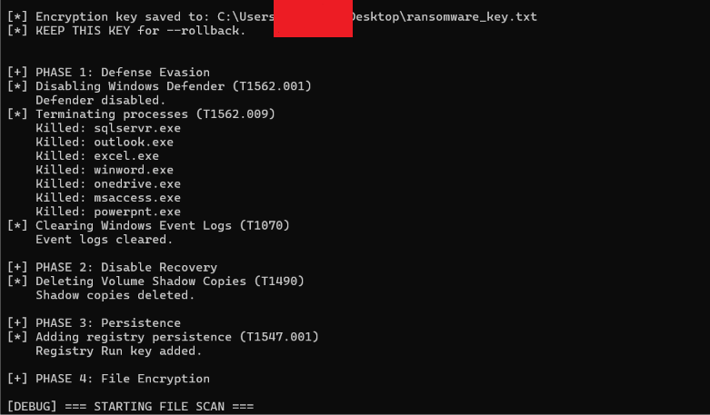

# Ransomware Emulator
Run real ransomware behavior in an isolated VM – encrypts files, deletes shadow copies, kills processes, adds persistence. Full rollback included.

**This script is for EDUCATIONAL AND LEARNING PURPOSES ONLY.** It is designed to run in an isolated, controlled lab environment.Use a VM snapshot.

## Quick Commands
- git clone https://github.com/yourusername/ransomware-emulator
- cd ransomware-emulator
- pip install cryptography
- python ransomware_emulator.py --attack
- python ransomware_emulator.py --rollback

## What You Will See

- Files get a `.qilin` extension  
- Ransom note on Desktop  
- Shadow copies deleted, processes killed  

## Safety

- Rollback decrypts all `.qilin` files, removes registry persistence and ransom note.  
- Shadow copies and event logs are **not** restored – that’s why you use a VM snapshot.

## Full Documentation

Detailed TTPs, detection rules, and usage examples are in the blog post:  
[Modern Ransomware Emulation: Test Your EDR Against Qilin, LockBit & More](https://adversarycraft.com/ransomware-emulation-qilin-lockbit)

## Disclaimer

For authorised testing only. Not for production systems. Author assumes no liability for misuse.
